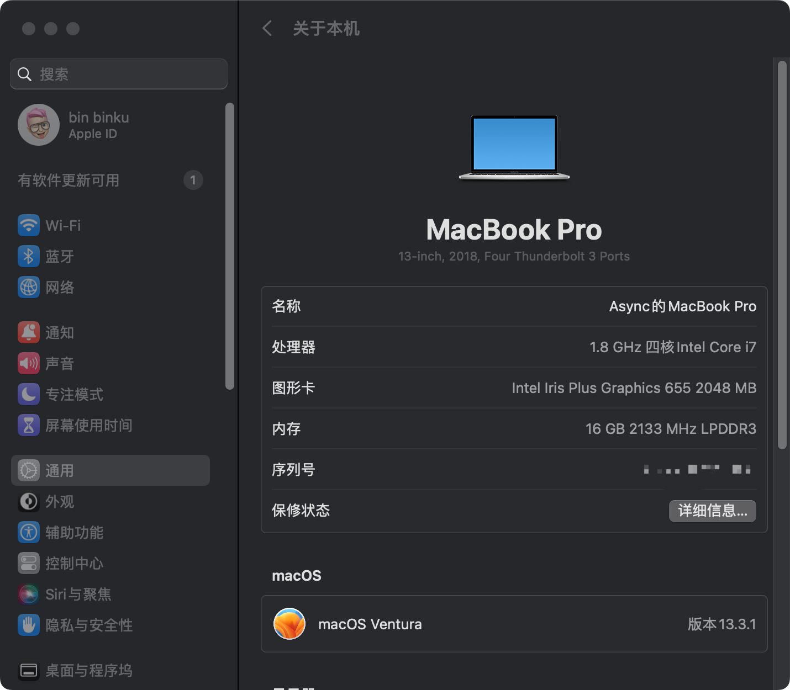
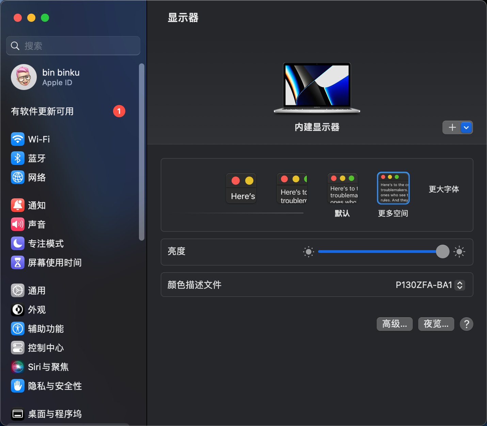
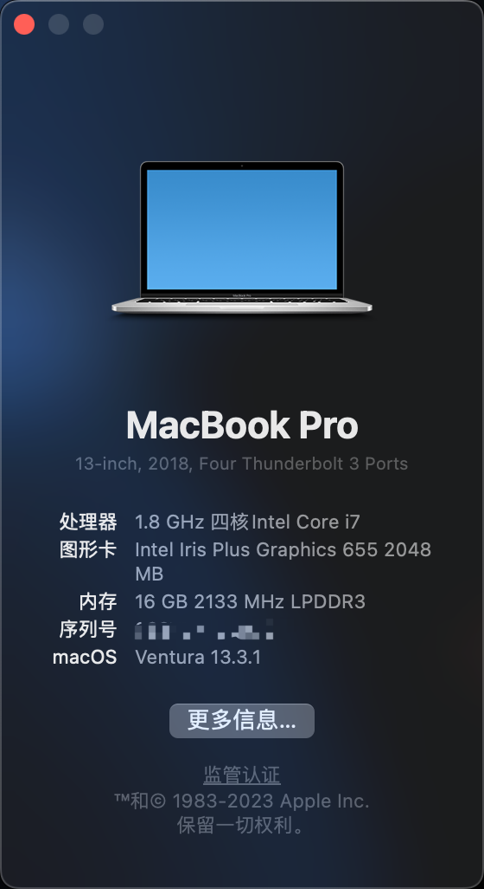

# MateBook13 2019 Ventura EFI 

> EFI 原地址 : [代码仓库](https://github.com/ske1996/matebook-13and14-OpenCore-Hackintosh) 感谢🙏大神ske1996 

注：我只是升级了OC配置文件和驱动

**配置:**
> CPU : i5 8265U

> 内存 : 16GB

> 硬盘 : BIWIN 512GB 注:机械革命笔记本上拆的

> 显卡 : UHD620

> 网卡 : AC9560

**状态**

✅ 正常开机

✅ 蓝牙

✅ Wifi

✅ 声卡

✅ HiDPi

✅ 睡眠

**截图**

